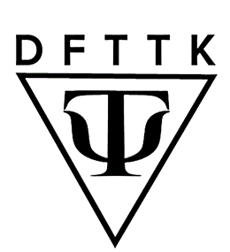

# DFTTK

    

## Overview
The **D**ensity **F**unctional **T**heory **T**ool**K**it is a Python package for automating VASP jobs and storing relevant results on MongoDB. The VASP workflows are based on [Custodian](https://github.com/materialsproject/custodian), and [PyMongo](https://github.com/mongodb/mongo-python-driver) is used to store the results on MongoDB.

## Key Features

- **Prepare VASP input files**
  - Given a POSCAR file, generates the INCAR, KPOINTS, and POTCAR files automatically
  - Generate magnetic configurations
- **VASP workflows**
  - Convergence tests
  - Free energy workflows
- **Analysis**
  - Equation of state (EOS) fitting
  - Harmonic approximation
  - Quasi-harmonic approximation
- **MongoDB**
  - Store results on a MongoDB database

## Installation
It is recommended to first set up a virtual environment using Conda:

    conda create -n dfttk python=3.12      
    conda activate dfttk

Clone the main brach of the repository:
    
    git clone https://github.com/PhasesResearchLab/dfttk.git

Or clone a specific branch:
    
    git clone -b <branch_name> https://github.com/PhasesResearchLab/dfttk.git

  Then move to `dfttk` directory and install in editable (`-e`) mode.

    cd dfttk
    pip install -e .

## Documentation
A more complete description of DFTTK and its capabilities can be found in the [documentation](https://vasp-job-automation.readthedocs.io/en/latest/index.html). 
