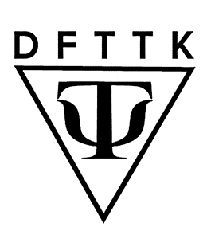

# DFTTK 

    

## Overview
Over the years, many tools have been developed to help set up and/or automate DFT calculations with VASP, as well as provide various post-processing features, such as [atomate2](https://github.com/materialsproject/atomate2), [quacc](https://github.com/Quantum-Accelerators/quacc), [AFLOW](https://www.aflowlib.org/), [AiiDA](https://www.aiida.net/), [pyiron](https://pyiron.org/), and [VASPkit](https://vaspkit.com/). The **Density Functional Theory ToolKit (DFTTK)** is another addition to this space, with a philosophy of keeping the interface between the user and VASP as minimal as possible and making the automation and post-processing steps easy to see and understand.

DFTTK workflows use [Custodian](https://github.com/materialsproject/custodian) for job management. The usefulness of Custodian is that it allows many VASP jobs to be chained together and includes various self-correction strategies for handling VASP errors. 

Current key features are listed below.

## Key Features

### Enumeration of Configurations
- Enumerates **unique collinear magnetic configurations** for a given structure.

### VASP Workflows
- Performs **convergence tests** for:
  - Cutoff energy (`ENCUT`)
  - k-points grid density (`kppa`)
- Computes **free energy** using the **quasiharmonic approximation**.

### MongoDB Storage
- Stores and retrieves VASP **input data** and **post-processed results** in MongoDB.

## Installation
It is recommended first to set up a virtual environment using Conda:

    conda create -n dfttk python=3.12      
    conda activate dfttk

Clone the main branch of the repository:
    
    git clone https://github.com/PhasesResearchLab/dfttk.git

Or clone a specific branch:
    
    git clone -b <branch_name> https://github.com/PhasesResearchLab/dfttk.git

  Then move to `dfttk` directory and install in editable (`-e`) mode.

    cd dfttk
    pip install -e .

> **Note:** A PyPI release is currently under development.

## Documentation

For a comprehensive description of **DFTTK** and its capabilities, please refer to the [Official Documentation](https://vasp-job-automation.readthedocs.io/en/latest/index.html).

> **Note:** The documentation is currently under construction. Some sections may be incomplete or subject to change.

## Citing DFTTK

If you use **DFTTK** in your work, please cite the following publication:

> **N. Hew et al.**,  
> *Density Functional Theory ToolKit (DFTTK) to automate first-principles thermodynamics via the quasiharmonic approximation*, **Computational Materials Science**, Volume 258, 2025, 114072, ISSN 0927-0256.  
> [https://doi.org/10.1016/j.commatsci.2025.114072](https://doi.org/10.1016/j.commatsci.2025.114072) ([View on ScienceDirect](https://www.sciencedirect.com/science/article/pii/S092702562500415X))
