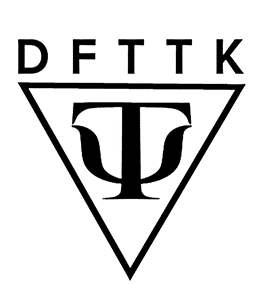

.. dfttk documentation master file, created by
   sphinx-quickstart on Fri May 31 10:27:03 2024.
   You can adapt this file completely to your liking, but it should at least
   contain the root `toctree` directive.

=====
DFTTK
=====

Welcome to the DFTTK documentation. This section provides an overview of the project and its capabilities.

DFTTK (Density Functional ToolKit) is a flexible tool for automating density functional theory (DFT) calculations with VASP 
and storing results in MongoDB. 
It leverages `Custodian <https://github.com/materialsproject/custodian>`_ for job submission and error handling, while 
`PyMongo <https://github.com/mongodb/mongo-python-driver>`_ facilitates data storage and retrieval in MongoDB.
DFTTK is developed openly on `GitHub <https://github.com/PhasesResearchLab/dfttk>`_. The project is led by Nigel Hew 
(postdoctoral researcher) and Luke Myers (Ph.D. student) at the Phases Research Lab, Penn State.

What does DFTTK do?
-------------------
**Enumeration of Configurations**

- Enumerates unique collinear magnetic configurations for a given structure.

**VASP Workflows**

- Performs convergence tests for cutoff energy (**ENCUT**) and k-points grid density (**kppa**).
- Computes free energy using the quasiharmonic approximation.

**MongoDB Storage**

- Stores and retrieves VASP input data and post-processed results in MongoDB.

.. toctree::
   :maxdepth: 2
   :caption: Contents:
   :hidden:

   installation
   tutorials/index
